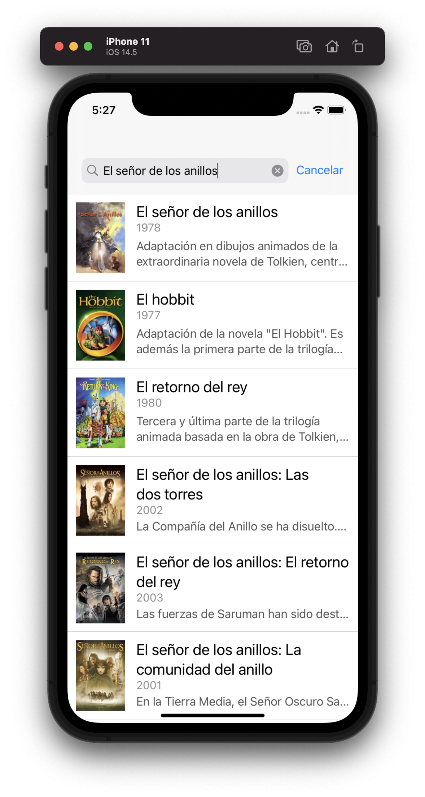
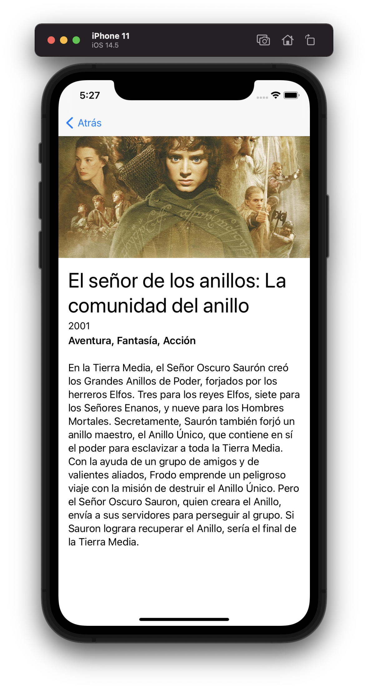

# CombineExample
Ejemplo de app para buscar películas utilizando Combine y la arquitectura MVVM.

	
	

# Versión Xcode
Se ha compilado con la versión 12.5.

# Versión mínima de iOS
La versión mínima es iOS 14 debido a un nuevo operador `flatMap` que se utiliza en el ejemplo. En iOS 14 se puede aplicar el operador a un `AnyPublisher<T, Never>`, algo que no se podía hacer en iOS 13.

# API key
Se ha utilizado la plataforma [themoviedb.org](https://www.themoviedb.org) para obtener la información sobre las películas. En el fichero `TMDBConfig.swift` existe un atributo `apiKey` necesario para consumir los servicios de este proveedor. Si quieres utilizar otro api key diferente al proporcionado en este ejemplo, puedes crear uno nuevo desde [aquí](https://www.themoviedb.org/settings/api).